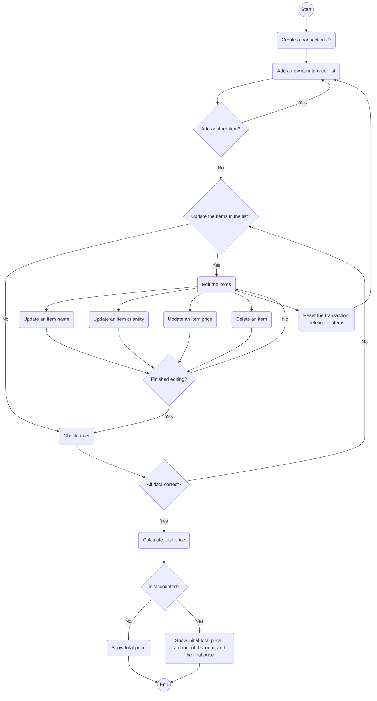

# Python Project: Super Cashier App

## A. Project Bacground
A supermarket owner needs to improve his supermarket's business process.<br />
To do that, he wants to provide his customers a self-service cashier app.

<br />

## B. Objectives and Requirements
### 1. Objectives
The supermarket customers can see the total amount of their transaction by inputting the items information to the order list.

<br />

### 2. Requirements
The cashier module is able to:
1. Create a transaction ID containing all items in order list
2. Add an item, its quantity, and its price to the order list 
3. Update the name of an item
4. Update the quantity of an item
5. Update the price of an item
6. Delete an item based on its name
7. Reset the transaction data, erasing all items in order list
8. Check whether the item data inputted is correct
9. Show the total price of all items in order list

<br />

## C. Program Flowchart



<br />

## D. Code Snippets
### 1. Transaction Class
```python
class Transaction:
    def __init__(self):
        self.order_items = {}
```
By initializing the Transaction Class, it will create a dictionary which will contain the order items information.

<br />

### 2. add_item() Method
```python
def add_item(self, item_name, item_qty, item_price):
        self.item_name = str(item_name).title()
        try:
            self.item_qty = int(item_qty)
            self.item_price = int(item_price)
            self.order_items[self.item_name] = [self.item_qty, self.item_price]
        except:
            print("Tidak dapat menambahkan item. \nJumlah dan harga item harus berupa angka.\n")
```
Input item name, quantity, and price as arguments for this method.
<br />
it will store the item name as a key and its quantity and price as value to the transaction dictionary.
<br />

If the arguments type are incorrect, the items will not be added and will show an error message instead.

<br />

### 3. show_order_table() Method
```python
def show_order_table(self):
        order_table = []

        table_header = ['No','Nama Item','Jumlah Item',
            'Harga/Item','Harga Total']
        order_table.append(table_header)
    
        n = 1
        
        for key, value in self.order_items.items():
            table_no = n 
            item_name = key
            item_qty = value[0]
            item_price = value[1]
            amount = item_qty * item_price
 
            item_data = [table_no, item_name, item_qty, 
                        item_price, amount]

            order_table.append(item_data)
            n += 1
        
        print(tabulate(order_table, headers="firstrow"))
```
This methods shows the items inside the transaction dictionary as a table using the tabulate module. 
<br />

On the other hand, this method also calculates and displays the total amount of each items based on its quantity and price.

<br />

### 4. update_item_name() Method
```python
def update_item_name(self, item_name, new_item_name):
        self.item_name = str(item_name)
        self.new_item_name = str(new_item_name)
        
        try:
            self.order_items[self.new_item_name] = self.order_items[self.item_name]
            del self.order_items[self.item_name] # Delete the old key
        except:
            print("Gagal mengubah nama item. \nNama item tidak ditemukan\n")
    
```
Update the name of an item in the list by providing the item name and its new name as the arguments to this method. 
<br />

This method will give an error message if the item name inputted isn't found in the order list.
<br />

### 5. update_item_qty() Method
```python
def update_item_qty(self, item_name, new_item_qty):
        self.item_name = str(item_name)
        
        try:
            self.new_item_qty = int(new_item_qty)
            try:
                self.order_items[self.item_name][0] = self.new_item_qty
                
            except:
                print("Gagal mengubah jumlah item. \nNama item tidak ditemukan.\n")
        except:
            print("Jumlah item harus berupa angka.\n")
```
Update the quantity of an item in the list by providing the item name and its new quantity as the arguments to this method. 
<br />

This method will give an error message if the item name inputted isn't found in the order list.
<br />

### 6. update_item_qty() Method
```python
def update_item_price(self, item_name, new_item_price):
    self.item_name = str(item_name)
    
    try:
        self.new_item_price = int(new_item_price)
        try:
            self.order_items[self.item_name][1] = self.new_item_price
        except:
            print("Gagal mengubah harga. \nNama item tidak ditemukan.\n")
    except:
        print("Harga item harus berupa angka.\n")
```
Update the price of an item in the list by providing the item name and its new item price as the arguments to this method. 
<br />

This method will give an error message if the item name inputted isn't found in the order list.
<br />

### 7. delete_item() Method
```python
def delete_item(self, item_name):
    self.item_name = str(item_name)
    try:
        del self.order_items[self.item_name]
    except:
        print("Gagal menghapus item. \nNama item tidak ditemukan.\n")
```
Delete an item in the order list by providing the name of the item as the argument to this method. 
<br />

This method will give an error message if the item name inputted isn't found in the order list.
<br />

### 8. reset_transaction() Method
```python
def reset_transaction(self):
    transaction = {}
    self.order_items = transaction
    print("Semua item berhasil dihapus.\n")
```
This method will reset the transaction, deleting all items inside the order list, left it as an empty dictionary. 
<br />

When the process is done, it will give a success message.
<br />

### 9. check_order() Method
```python
def check_order(self):
    for key, value in self.order_items.items():
        item_name = key
        item_qty = value[0]
        item_price = value[1]
        
        if type(item_name) == str and type(item_qty) == int and type(item_price) == int:
            print(f"[v] {item_name :<12}: data sudah sesuai.")           
        else:
            if type(item_name) != str:
                print(f"[x] {item_name :<12}: nama barang harus berupa teks.")
            else:
                pass   
            
            if type(item_qty) != int:
                print(f"[x] {item_name :<12}: jumlah item harus berupa angka.")
            else:
                pass

            if type(item_price) != int:
                print(f"[x] {item_name :<12}: harga item harus berupa angka.")
            else:
                pass
```
This method will check whether the item inputted into the order list has certain data types.
<br />

It will show a success message if the key and the values of the item is in expected data type.
<br />

On the other hand, it will show an error message if the key or value of the item is not in certain data type.
<br />

### 10. total_price() Method
```python
def total_price(self):
    self.total_price = 0
    for value in self.order_items.values():
        item_qty = value[0]
        item_price = value[1]
        self.total_price += (item_qty * item_price)
        
    is_discounted, discount = self.is_discounted(self.total_price)
    self.final_price = self.total_price * (1 - discount)

    if is_discounted == True:
        print(f"Total belanja Anda: Rp{self.total_price}.")
        print(f"Anda mendapat diskon {discount * 100}%.")
        print(f"Anda hanya perlu membayar: Rp{self.final_price}.")
    else:
        print(f"Total belanja Anda: Rp{self.total_price}.")
        print("Belanja di atas Rp200.000 untuk mendapat diskon.")
```
This method calculates the sum of the amount of each item in the order list.
<br />

It will also show how much the customer will pay after the discount (if applicable).
<br />

### 11. is_discounted() Method
```python
def is_discounted(self, total_price):
    self.total_price = total_price
    if self.total_price <= 200000:
        is_discounted = False
        discount = 0.0
    else:
        is_discounted = True
        if self.total_price > 500000:
            discount = 0.1
        elif total_price > 300000:
            discount = 0.08
        elif total_price > 200000:
            discount = 0.05

    return is_discounted, discount
```
Based on the total price inputted as argument, this method will confirm whether a transacation will get a discount or not. It will decide how much discount the transaction is going to get.
<br />

This method returns the discount status (boolean) and the discount rate (float).
<br />

## E. How to use this module
### 1. Import the requirements and the cashier module
```
pip install requirements.txt
```

```python
import cashier
trnsct_123 = cashier.Transaction()
```

<br />

### 2. Add a new item
Add an item to the order list.
```python
trnsct_123.add_item("Ayam Goreng", 2, 20000)
```

Show the item ordered as a table.
```python
trnsct_123.show_order_table()
```

The output:
```
No  Nama Item      Jumlah Item    Harga/Item    Harga Total
----  -----------  -------------  ------------  -------------
   1  Ayam Goreng              2         20000          40000
```

<br />

### 4. Update item name
Change the item name from "Ayam Goreng" to "Pasta Gigi."
```python
trnsct_123.update_item_name("Ayam Goreng", "Pasta Gigi")
```

Show the item ordered as a table.
```python
trnsct_123.show_order_table()
```

The output:
```
No  Nama Item      Jumlah Item    Harga/Item    Harga Total
----  ----------  -------------  ------------  -------------
   1  Pasta Gigi              2         20000          40000
```

<br />

### 5. Update item quantity
Change the item quantity of "Pasta Gigi" to 4.
```python
trnsct_123.update_item_qty("Pasta Gigi", 4)
```

Show the item ordered as a table.
```python
trnsct_123.show_order_table()
```

The output:
```
No  Nama Item      Jumlah Item    Harga/Item    Harga Total
----  ----------  -------------  ------------  -------------
   1  Pasta Gigi              4         20000          40000
```

<br />

### 6. Update item price
Change the item price of "Pasta Gigi" to 15000.
```python
trnsct_123.update_item_price("Pasta Gigi", 15000)
```

Show the item ordered as a table.
```python
trnsct_123.show_order_table()
```

The output:
```
No  Nama Item      Jumlah Item    Harga/Item    Harga Total
----  ----------  -------------  ------------  -------------
   1  Pasta Gigi              4         15000          40000
```

<br />

### 8. Delete item
Given your order list consisting these items:
```
  No  Nama Item       Jumlah Item    Harga/Item    Harga Total
----  ------------  -------------  ------------  -------------
   1  Ayam Goreng               2         20000          40000
   2  Pasta Gigi                3         15000          45000
   3  Mainan Mobil              1        200000         200000
   4  Mie Instant               5          3000          15000
```

Delete an item named "Pasta Gigi".
```python
trnsct_123.delete_item("Pasta Gigi")
```

Show the item ordered as a table.
```python
trnsct_123.show_order_table()
```

The output:
```
  No  Nama Item       Jumlah Item    Harga/Item    Harga Total
----  ------------  -------------  ------------  -------------
   1  Ayam Goreng               2         20000          40000
   2  Mainan Mobil              1        200000         200000
   3  Mie Instant               5          3000          15000
```

<br />

### 9. Reset transaction (Clear all items)
Given your order list consisting these items:
```
  No  Nama Item       Jumlah Item    Harga/Item    Harga Total
----  ------------  -------------  ------------  -------------
   1  Ayam Goreng               2         20000          40000
   2  Pasta Gigi                3         15000          45000
   3  Mainan Mobil              1        200000         200000
   4  Mie Instant               5          3000          15000
```

Reset the transaction.
```python
trnsct_123.reset_transaction()
```

The output:
```
Semua item berhasil dihapus.
```

Show the item ordered as a table.
```python
trnsct_123.show_order_table()
```

The output:
```
  No  Nama Item       Jumlah Item    Harga/Item    Harga Total
----  ------------  -------------  ------------  -------------
```

<br />

### 10. Check the items data status
Given your order list consisting these items:
```
  No  Nama Item       Jumlah Item    Harga/Item    Harga Total
----  ------------  -------------  ------------  -------------
   1  Ayam Goreng               2         20000          40000
   2  Pasta Gigi                3         15000          45000
   3  Mainan Mobil              1        200000         200000
   4  Mie Instant               5          3000          15000
```

Check whether the item datas inputted are okay or not.
```python
trnsct_123.check_order()
```

The output:
```
[v] Ayam Goreng : data sudah sesuai.
[v] Pasta Gigi  : data sudah sesuai.
[v] Mainan Mobil: data sudah sesuai.
[v] Mie Instant : data sudah sesuai.
```

<br />

### 11. Check the total price of All the items ordered
Given your order list consisting these items:
```
  No  Nama Item       Jumlah Item    Harga/Item    Harga Total
----  ------------  -------------  ------------  -------------
   1  Ayam Goreng               2         20000          40000
   2  Pasta Gigi                3         15000          45000
   3  Mainan Mobil              1        200000         200000
   4  Mie Instant               5          3000          15000
```

Check the total price of all the items and the final price you need to pay.
```python
trnsct_123.total_price()
```

The output:
```
Total belanja Anda: Rp300000.
Anda mendapat diskon 5.0%.
Anda hanya perlu membayar: Rp285000.0.
```

<br />